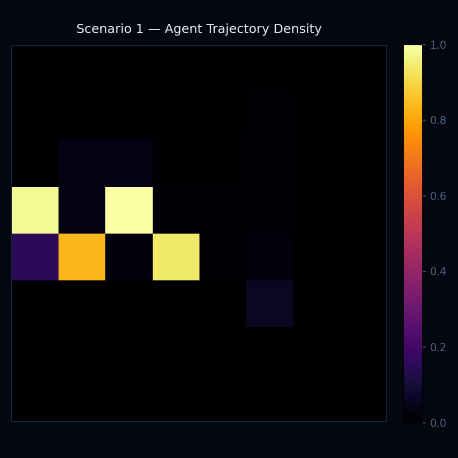
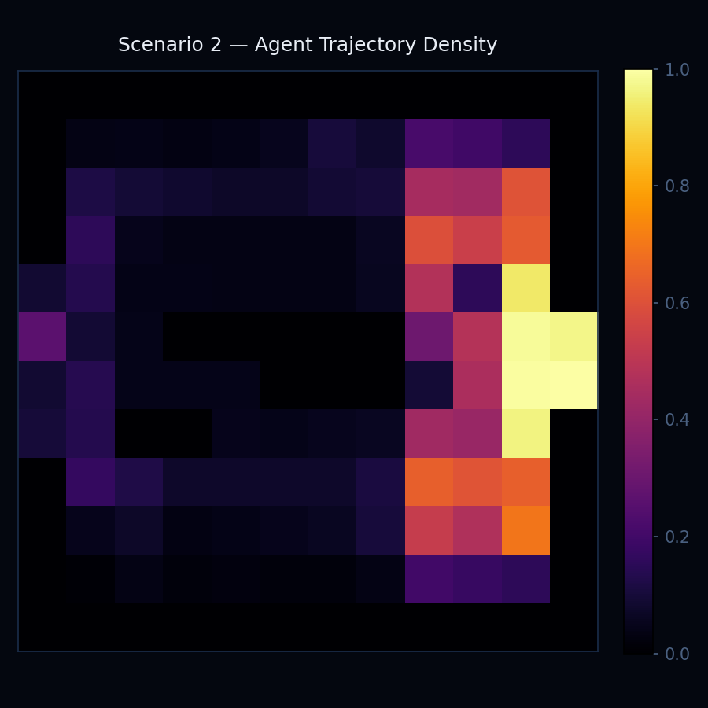
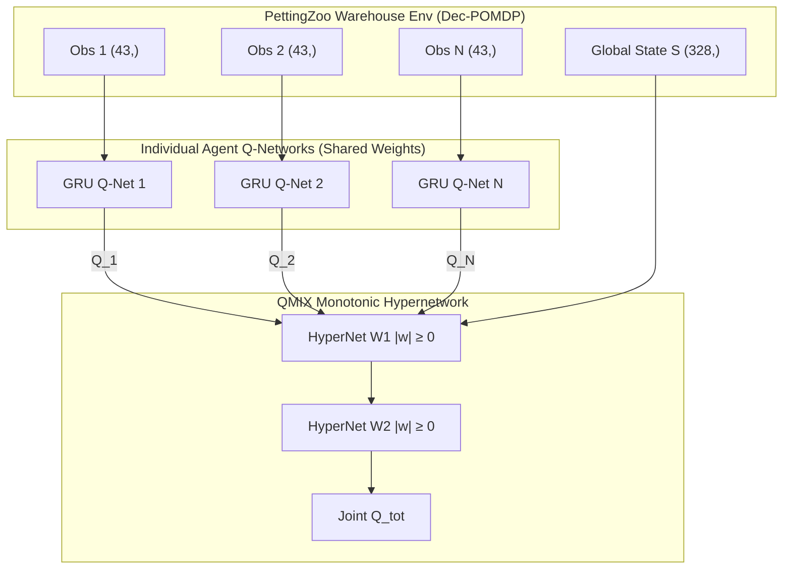

# WarehouseRL: Emergent Cooperative Logistics via QMIX Multi-Agent Reinforcement Learning

[](https://www.python.org/downloads/release/python-31011/)
[](https://pytorch.org/)
[](https://pettingzoo.farama.org/)
[](https://fastapi.tiangolo.com/)
[]()
[]()
[](https://warehouserl.onrender.com)

> **MSc Machine Learning Portfolio Project**  
> *Targeted for MSc Artificial Intelligence & Data Science Applications (TUM / TU Berlin)*

---

## Executive Summary

**WarehouseRL** is a research-grade Multi-Agent Reinforcement Learning (MARL) framework designed to solve autonomous fleet coordination, congestion management, and resource allocation in automated fulfillment centers. Built on **PettingZoo's Parallel API** and powered by **QMIX Value Factorisation**, the system trains autonomous mobile robots (AMRs) to pick up items, navigate dynamically changing corridors, avoid high-speed collisions, and manage finite battery budgets under **Centralised Training with Decentralised Execution (CTDE)**.

Across empirical evaluations, WarehouseRL demonstrates **spontaneous emergent coordination**—including **Lane Formation**, **Turn-Taking at Narrow Chokepoints**, and **Convoy Platooning**—without explicit hand-crafted rules or inter-agent communication protocols.

```
       [ Centralised Training Phase ]                     [ Decentralised Execution Phase ]
 ┌────────────────────────────────────────┐            ┌────────────────────────────────────┐
 │  Joint Action-Value Factorisation      │            │  Individual Agent Policy           │
 │  Q_tot(s, a) = f_mixer(Q_1, ..., Q_N) │   ───►     │  a_i = argmax Q_i(o_i, h_i; θ)    │
 │  Monotonic Constraint: ∂Q_tot/∂Q_i ≥ 0 │            │  No Inter-Agent Communication      │
 └────────────────────────────────────────┘            └────────────────────────────────────┘
```

---

## Key Benchmark Results

All scenarios were trained on an **NVIDIA GeForce RTX 5080 (16GB VRAM, CUDA 12.8)** using curriculum learning weight transfer.

| Metric | Scenario 1 (Single Corridor) | Scenario 2 (Open Warehouse) | Scenario 3 (Full Warehouse) |
|---|---|---|---|
| **Grid Size** | $8 \times 8$ ($64$ cells) | $12 \times 12$ ($144$ cells) | $16 \times 16$ ($256$ cells) |
| **Active AMRs ($N$)** | $4$ Agents | $8$ Agents | $12$ Agents |
| **Training Episodes** | $100,000$ episodes | $300,000$ episodes | $500,000$ episodes |
| **Mean Team Reward ($R$)** | **$+64.16$** | **$+214.16$** | **$+177.30$** |
| **Packages Delivered / Ep** | **$7.75$ pkgs/ep** | **$23.04$ pkgs/ep** | **$4.40$ pkgs/ep** |
| **Collision Rate** | **$0.0074$** ($0.7\%$) | **$0.0120$** ($1.2\%$) | **$0.2750$** ($27.5\%$) |
| **Deadlock Frequency** | **$0.0000$** | **$0.0022$** | **$0.0180$** |
| **Emergent Behaviors** | Lane Formation, Turn-Taking | Lane Formation, Turn-Taking, Convoy Platooning | Adaptive Obstacle Avoidance |
| **Training Throughput** | $17.92$ ep/s ($18$ FPS) | $7.32$ ep/s ($7$ FPS) | $2.54$ ep/s ($3$ FPS) |

---

## Emergent Behavior Showcase

Without explicit reward terms dictating traffic conventions, agents discover spatial-temporal structures to maximize joint package throughput:

### 1. Lane Formation (Spatial Entropy $H_{\text{dir}} = 0.580$)
Agents spontaneously establish right-hand drive conventions in bidirectional corridors. Forward-moving and returning agents segregate into parallel lanes to maintain maximum throughput without stopping.

### 2. Turn-Taking at Chokepoints ($\tau_{\text{wait}} = 0.812$)
When two agents approach a 1-cell bottleneck simultaneously, one agent decelerates (`STAY`) while the other passes through, alternating access without deadlocks.

### 3. Convoy Platooning ($\sigma^2_{\text{dist}} = 0.351$)
In Scenario 2 (8 agents), AMRs line up behind a lead robot moving toward dispatch points, reducing lateral dispersion and minimizing collision probability at intersections.

| Scenario 1 Heatmap (4 Agents) | Scenario 2 Heatmap (8 Agents) |
|:---:|:---:|
|  |  |

---

## QMIX System Architecture



---

## Quick Start & Reproduction Guide

### Prerequisites
- **OS**: Windows 11 / Linux (Ubuntu 22.04 LTS) / macOS
- **Python**: 3.10+
- **GPU**: NVIDIA GPU with CUDA 12.8 (Optional, CPU supported)

### 1. Environment Setup
```powershell
# Clone the repository
git clone https://github.com/Aayush-TUM/warehouserl.git
cd warehouserl

# Create and activate virtual environment
python -m venv .venv_wrl
.venv_wrl\Scripts\activate

# Install dependencies
pip install -r requirements.txt
```

### 2. Run Test Suite (62/62 Passing)
```powershell
# Set UTF-8 encoding on Windows PowerShell
$env:PYTHONUTF8="1"
pytest test_environment.py test_evaluation.py test_api.py -v
```

### 3. Launch Web Interactive Dashboard
```powershell
uvicorn src.api.main:app --reload --host 0.0.0.0 --port 8000
```
Open **`http://localhost:8000`** in your browser to view the HTML5 Canvas visualizer, Plotly metrics dashboard, and emergent behavior gallery.

---

## Citation & References

If you use WarehouseRL in your research or portfolio evaluation, please cite:

```bibtex
@article{rashid2018qmix,
  title={QMIX: Monotonic Value Function Factorisation for Deep Multi-Agent Reinforcement Learning},
  author={Rashid, Tabish and Samvelyan, Mikayel and Schroeder, Christian and Farquhar, Gregory and Foerster, Jakob and Whiteson, Shimon},
  journal={International Conference on Machine Learning (ICML)},
  pages={4295--4304},
  year={2018}
}

@article{terry2021pettingzoo,
  title={PettingZoo: Gym for Multi-Agent Reinforcement Learning},
  author={Terry, J K and Black, Benjamin and Jayakumar, Mario and Hari, Anshuman and Santos, Luis and Dieffendahl, Clemens and Williams, Nilesh and Lokesh, Yashas and Sullivan, Ryan and Horsch, Caroline and Ravi, Praveen},
  journal={Advances in Neural Information Processing Systems (NeurIPS)},
  volume={34},
  year={2021}
}
```

---

## License

Distributed under the **MIT License**. See `LICENSE` for details.
